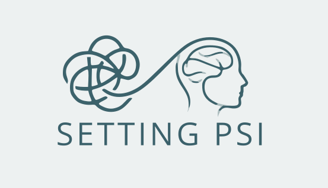

<p align="center">
  
</p>

<p align="center">
  Plataforma web para organizar atendimentos, pacientes, prontuários e horários de uma clínica de psicologia.
</p>

<p align="center">
  
  
  
  
</p>

## Sobre o projeto

O **Psica** centraliza a rotina de uma clínica em uma única aplicação: o paciente encontra um horário disponível e solicita uma sessão, enquanto profissionais e administradores acompanham a agenda e mantêm os registros internos.

A experiência combina um fluxo público simples com um painel autenticado para a operação diária. A agenda é alimentada por slots de disponibilidade e protegida por validações contra conflitos de horário.

## O que já está disponível

- Solicitação pública de sessão, sem necessidade de login.
- Calendário com disponibilidade e agendamentos.
- Cadastro, edição e listagem de pacientes.
- Prontuários vinculados aos pacientes.
- Gestão de agendamentos e slots de disponibilidade.
- Autenticação, verificação de e-mail e gerenciamento de perfil.
- API para consulta de slots e agendamentos pelo calendário.
- Compatibilidade gradual com estruturas de banco em português e inglês.

## Stack

| Camada | Tecnologia |
| --- | --- |
| Backend | PHP 8.2+ e Laravel 11 |
| Interface | Blade, Tailwind CSS e Alpine.js |
| Calendário | FullCalendar |
| Banco de dados | MariaDB/MySQL |
| Assets | Vite |
| Infraestrutura local | Docker Compose, Nginx e PHP-FPM |

## Como executar localmente

### Pré-requisitos

- Docker e Docker Compose.
- Node.js e npm, caso os assets sejam compilados fora do container.
- Acesso a um banco MariaDB/MySQL configurado no `.env`.

### Instalação

```bash
git clone https://github.com/corneliopj/psica.git
cd psica
cp .env.example .env
composer install
php artisan key:generate
npm install
npm run build
```

Configure no `.env` a conexão do banco e então execute as migrations:

```bash
php artisan migrate
php artisan serve
```

A aplicação ficará disponível em `http://127.0.0.1:8000`.

### Usando Docker

O projeto inclui serviços para PHP-FPM, Nginx, Node e um MariaDB local opcional:

```bash
docker compose --profile local-db up -d --build
```

Nesse modo, a aplicação fica disponível em `http://localhost:8080`. Para usar um MariaDB remoto, configure as variáveis `DB_HOST`, `DB_PORT`, `DB_DATABASE`, `DB_USERNAME` e `DB_PASSWORD` no `.env` e inicie apenas os serviços necessários.

## Deploy no Plesk

A estrutura esperada pelo Laravel Toolkit é:

```text
httpdocs/
├── artisan
├── app/
├── bootstrap/
├── config/
├── public/          <- document root do domínio
├── resources/
├── routes/
├── storage/
└── vendor/
```

No Plesk, configure o **Document root** do domínio como:

```text
httpdocs/public
```

O arquivo `artisan` deve ficar no diretório pai de `public`. Em produção, configure `APP_ENV=production`, `APP_DEBUG=false` e uma `APP_KEY` válida. Depois da instalação das dependências, limpe e reconstrua os caches:

```bash
php artisan optimize:clear
php artisan config:cache
php artisan route:cache
php artisan view:cache
```

Garanta também permissão de escrita para o usuário do site em `storage/` e `bootstrap/cache/`.

## Estrutura do projeto

```text
app/
├── Http/Controllers/     # Fluxos públicos, autenticação e backoffice
├── Models/               # Pacientes, prontuários, agenda e usuários
└── Services/             # Regras de negócio da aplicação
database/
├── migrations/           # Estrutura e evolução do banco
└── seeders/              # Dados iniciais e de desenvolvimento
resources/
├── js/                   # Calendário e comportamento da interface
├── css/                  # Estilos Tailwind
└── views/                # Templates Blade
public/
├── favicon/              # Ícones do navegador
└── images/               # Logos da aplicação
```

## Comandos úteis

```bash
# Compilar assets para produção
npm run build

# Verificar o status das migrations
php artisan migrate:status

# Executar os testes
php artisan test

# Limpar caches da aplicação
php artisan optimize:clear
```

## Status

O fluxo principal de agendamento, disponibilidade, pacientes e prontuários está implementado. A aplicação está preparada para deploy em ambiente externo com MariaDB. A validação contínua deve priorizar os nomes de tabelas em português/inglês, as regras de conflito de horários e os testes de integração do fluxo público.

## Contribuição

Contribuições são bem-vindas. Para propor uma mudança:

1. Crie uma branch a partir de `main`.
2. Faça a alteração acompanhada dos testes necessários.
3. Valide o build e os comandos relevantes.
4. Abra um pull request descrevendo o problema e a solução.

## Licença

Este projeto está distribuído sob a licença MIT.
